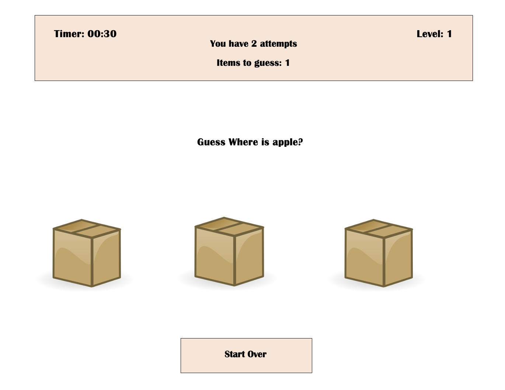
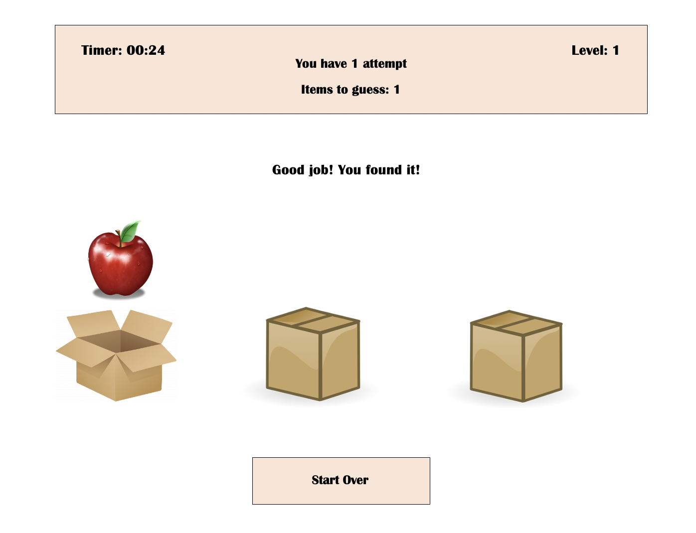
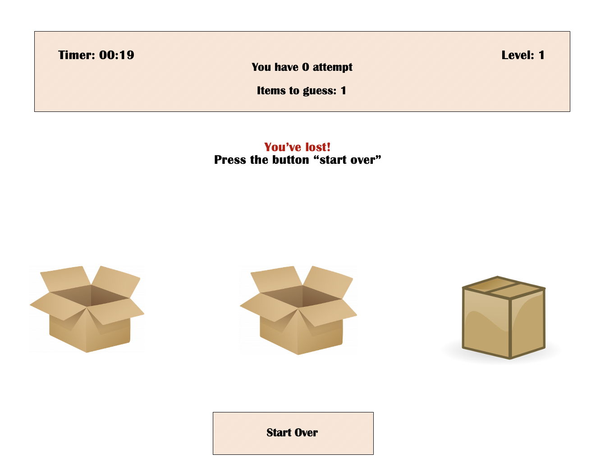
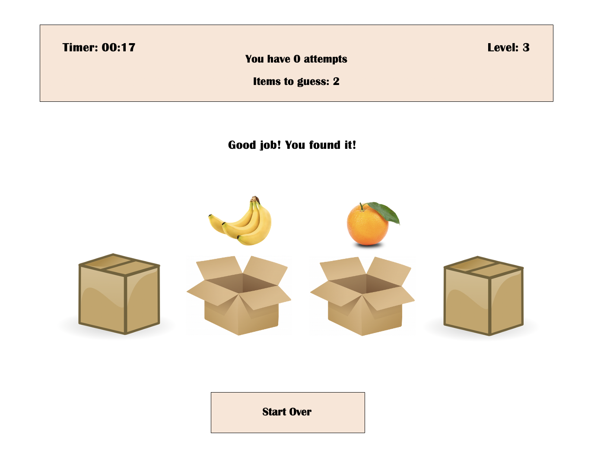
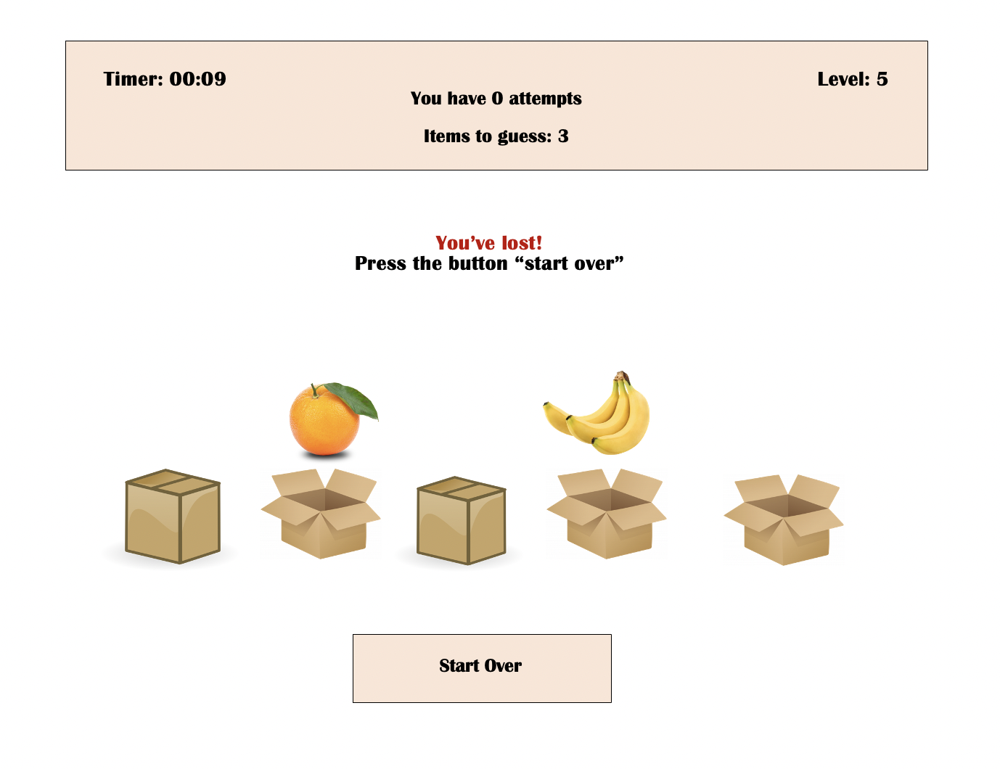

# Guess-where Game

## Topics
- Summary of the game
- Game rules
- Wireframes
- User stories
- MVP checklist
- Bonus Goals

## Summary of the game
An exiting game where you need to guess in which box the item is hidden. Do not waste time - rather start playing right now.
Currently not mobile friendly, may be in the future.

## Game rules
1. Guess the correct box to increase the level
2. Everytime you guess an incorrect box you will lose an attempt
3. The game ends when you run out of attempts or time

## Wireframes
 
Initial view of game

You found an item on 1st level

You run out of attempts and didn't guess where the item is

You found 2 items on 3rd level

You found only 2 items of 3 on 5th level and run out of attempts - lost the game

## User stories
1. Everytime you click on the closed box it opens
2. You have 2 attempts (on 1-3 leves) and 3 attempts (on 5-4 levels)
3. Everytime you open the box - the number of attempts decreases
4. When you open correct box your level goes up
5. If you run out of attempts and have unguessed item - you lost the game
6. If you run out of time - you lost the game

## MVP checklist

  Level | Items to guess |  Boxes | Attempts
--------|----------------|--------|----------
1 level	|       1	     |    3   |    2
2 level	|       1	     |    4   |    2
3 level	|       2	     |    4   |    2
4 level	|       2	     |    5   |    3
5 level	|       3	     |    5   |    3

## Bonus Goals
Add:
* Levels
* Boxes
* Items to guess
* Attempts
* reduce time on timer
